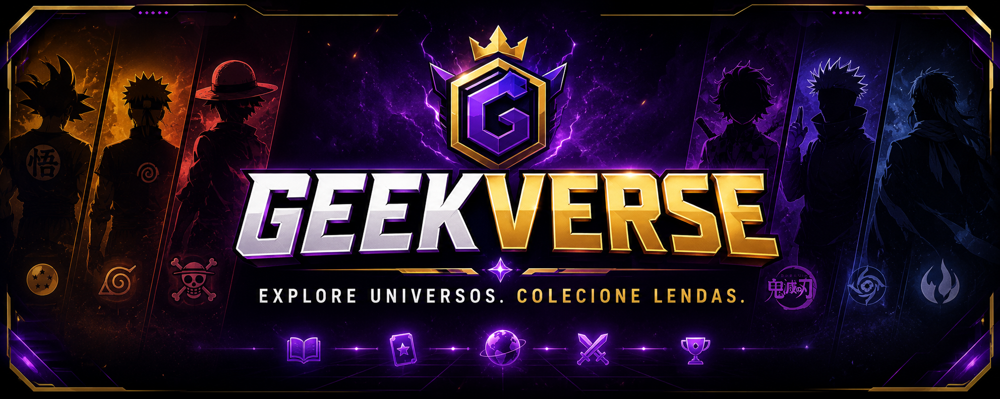

#<p align="center">
  
</p>

<h1 align="center">🎮 GeekVerse</h1>

<p align="center">
<strong>Explore universos. Colecione lendas.</strong>
</p>

<p align="center">
Muito mais que um álbum digital.<br>
Uma jornada pelos maiores universos da cultura geek.
</p>

## 📖 Sobre

O **GeekVerse** é uma aplicação web que transforma o conceito tradicional de álbuns de figurinhas em uma experiência digital interativa.

Criado inicialmente durante a **Imersão Alura**, o projeto evoluiu para uma aplicação autoral com identidade visual própria, integração entre frontend e backend e uma API desenvolvida em **FastAPI**.

Mais do que um exercício, o GeekVerse representa minha evolução prática em desenvolvimento web, organização de projetos, consumo de APIs e versionamento utilizando Git e GitHub.


🌌 Universos

🐉 Dragon Ball

🍥 Naruto

☠️ One Piece

👹 Demon Slayer

👁️ Jujutsu Kaisen

⚔️ Bleach

## ✨ Funcionalidades

🎴 Álbum digital interativo

🌌 30 personagens exclusivos

⚡ Backend desenvolvido em FastAPI

🖼️ Carregamento dinâmico das imagens

📖 Navegação entre páginas

🎨 Interface personalizada

🔗 Integração entre Frontend e Backend

## 🛠️ Tecnologias utilizadas

### Backend

- Python
- FastAPI
- Uvicorn

### Frontend

- HTML5
- CSS3
- JavaScript

## 📁 Estrutura do projeto

```text
GeekVerse/
├── Backend/
│   ├── figurinhas/
│   └── main.py
├── Frontend/
│   ├── app.js
│   ├── index.html
│   └── style.css
├── .gitignore
└── README.md